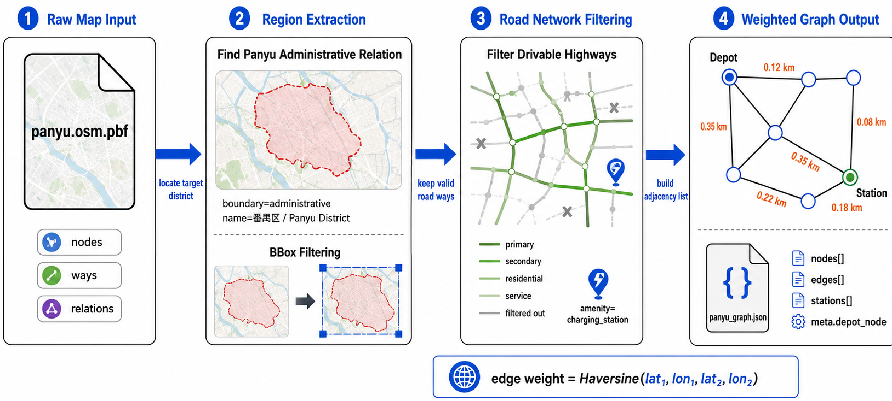

# 01 OSM 文件到城市路网加权图结构



## 这张图要表达什么

这张图展示的是：Engine 如何把原始 OSM 地图文件转换成仿真环境可以直接使用的城市路网加权图。

核心逻辑是一条线性流水线：

```text
Raw Map Input
  → Region Extraction
  → Road Network Filtering
  → Weighted Graph Output
```

答辩时可以先用一句话概括：

> 这部分的目标是把真实 OSM 地图数据裁剪、过滤并转换成带权图结构，使车辆路径规划、电量消耗和调度决策都能基于真实道路网络运行。

## 1. Raw Map Input：原始地图输入

图中第 1 部分是原始 OSM PBF 文件：

```text
panyu.osm.pbf
```

OSM 文件中包含三类基础元素：

```text
nodes
ways
relations
```

含义分别是：

| 元素 | 作用 |
| --- | --- |
| `node` | 地理点，包含经纬度 |
| `way` | 道路、边界或区域，由多个 node 组成 |
| `relation` | 复杂关系，例如行政区边界 |

可以这样讲：

> OSM 原始文件不是直接可用于调度的图结构，它里面混合了道路、建筑、边界、兴趣点等大量信息。所以第一步只是读取原始地图数据，后面还需要筛选出和车辆行驶相关的部分。

对应代码主要在：

```text
Engine/Map Resource/scripts/extract_panyu_pbf.py
Engine/Map Resource/scripts/build_panyu_graph.py
```

## 2. Region Extraction：目标区域提取

图中第 2 部分分成两个动作：

```text
Find Panyu Administrative Relation
BBox Filtering
```

### 2.1 查找番禺行政区 relation

脚本会在 OSM 数据中查找番禺区的行政边界：

```text
boundary = administrative
name = 番禺区
或 name:en = Panyu District
```

找到行政区 relation 后，就能得到番禺区边界对应的 way 和 node。

答辩时可以说：

> OSM 中行政区不是一个简单矩形，而是由 relation 表达的多边形边界。因此我先通过行政区 relation 找到番禺区，再根据它的边界节点确定目标区域。

### 2.2 BBox Filtering

找到番禺边界后，计算外接矩形 bbox：

```text
min_lat
min_lon
max_lat
max_lon
```

然后筛选 bbox 内的地图元素。

图中下半部分的红色边界和蓝色矩形框，就是从行政边界到 bbox 裁剪区域的过程。

可以这样讲：

> bbox 的作用是减少后续处理范围。我们只保留目标区域内的 node、way 和 relation，避免把整个大地图都加载进仿真环境。

## 3. Road Network Filtering：道路网络过滤

图中第 3 部分是道路筛选。

OSM 中的 `way` 不一定都是车辆可行驶道路，可能还包括：

- 行政边界。
- 建筑轮廓。
- 河流。
- 人行路径。
- 其他非道路对象。

因此脚本只保留可行驶的 `highway` 类型，例如图中的：

```text
primary
secondary
residential
service
```

灰色线表示被过滤掉的道路或无关对象，绿色线表示保留下来的可行驶路网。

可以这样讲：

> 这一步的核心是从 OSM 的复杂地理对象中筛选车辆可走的道路。只有符合可行驶 highway 类型的 way，才会被转换成仿真图中的边。

### 充电站识别

图中右下角的充电图标表示 OSM 中的充电站标签：

```text
amenity = charging_station
```

如果地图中存在充电站点，脚本会记录它的位置，并映射到最近的道路节点上。

可以这样讲：

> 充电站也来自 OSM 标签，但车辆只能在图节点上移动，所以充电站位置最终会绑定到最近的道路节点。

## 4. Weighted Graph Output：加权图输出

图中第 4 部分是最终得到的城市路网图。

图中蓝色节点表示道路节点，黑色线表示道路连接，橙色数字表示边权：

```text
0.12 km
0.35 km
0.08 km
```

边权的计算方式是：

```text
edge weight = Haversine(lat1, lon1, lat2, lon2)
```

也就是根据两个道路节点的经纬度计算真实地理距离。

答辩时可以说：

> 加权图中的每条边对应真实道路上的相邻节点连接，边权是两个经纬度点之间的球面距离。后续最短路径、车辆行驶距离和电量消耗都依赖这个边权。

### Depot 和 Station

图中标出了两个特殊节点：

```text
Depot
Station
```

它们本质上仍然是图节点，只是承担不同语义：

- `Depot`：车辆出发和返回的仓库节点。
- `Station`：车辆可以充电的充电站节点。

## 5. 输出 JSON 结构

最终图数据输出为：

```text
panyu_graph.json
```

图中列出了关键字段：

```text
nodes[]
edges[]
stations[]
meta.depot_node
```

含义如下：

| 字段 | 含义 |
| --- | --- |
| `nodes[]` | 路网节点，经纬度坐标 |
| `edges[]` | 道路边，包含两端节点和距离 |
| `stations[]` | 充电站节点 |
| `meta.depot_node` | 默认仓库节点 |

进入 Engine 后，这个 JSON 会被加载为邻接表图结构：

```text
Graph:
  nodes
  adj
  edge_lookup
```

## 6. 图中箭头如何讲

可以按箭头顺序讲：

```text
locate target district
```

表示从原始 OSM 中定位番禺区。

```text
keep valid road ways
```

表示只保留车辆可行驶道路。

```text
build adjacency list
```

表示将道路节点和道路边转换成图的邻接表。

这三个箭头刚好对应三步抽象：

```text
地图数据 → 区域数据 → 道路数据 → 图数据
```

## 7. 答辩讲稿

可以照着这段说：

> 这张图展示的是从 OSM 地图文件到城市路网加权图的过程。首先，原始输入是 `panyu.osm.pbf`，里面包含 nodes、ways 和 relations。由于 OSM 中混合了很多地理对象，所以我们先通过 `boundary=administrative` 和 `name=番禺区` 找到番禺行政区 relation，并根据行政区边界计算 bbox，只保留目标区域内的数据。
>
> 接下来进入道路网络过滤。OSM 中的 way 不一定都是车辆道路，所以我们根据 highway 标签筛选可行驶道路，例如 primary、secondary、residential 和 service 等类型。地图中的充电站则通过 `amenity=charging_station` 识别，并映射到最近的道路节点。
>
> 最后，把道路上的相邻节点连接成图边，并用 Haversine 公式根据经纬度计算真实距离作为边权。最终输出 `panyu_graph.json`，其中包含 nodes、edges、stations 和 depot_node。Engine 加载这个文件后，就可以基于邻接表进行最短路搜索、车辆移动和电量消耗计算。

## 8. 一句话总结

> 这张图的核心是：把原始 OSM 地图裁剪成目标区域，过滤出可行驶道路，并转换成带真实距离权重的城市路网图。

