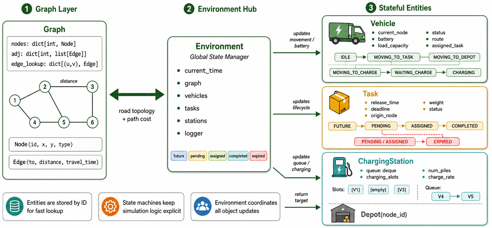

# 02 实体对象的数据结构设计



## 这张图要表达什么

这张图展示的是 Engine 内部的数据结构设计。

整体上分为三个区域：

```text
Graph Layer
  ↔ Environment Hub
  → Stateful Entities
```

答辩时可以先这样概括：

> Engine 中的对象不是散乱保存的，而是围绕 Environment 统一管理。左侧 Graph 提供道路拓扑和路径代价，中间 Environment 管理全局状态，右侧 Vehicle、Task、ChargingStation 和 Depot 是仿真中不断被更新的状态化实体。

## 1. Graph Layer：图结构层

图中左侧是 `Graph Layer`。

它对应城市路网数据结构：

```text
Graph:
  nodes: dict[int, Node]
  adj: dict[int, list[Edge]]
  edge_lookup: dict[(u,v), Edge]
```

### 1.1 nodes

```text
nodes: dict[int, Node]
```

含义是用节点 ID 快速查找节点对象。

节点结构：

```text
Node(id, x, y, type)
```

其中：

- `id`：节点编号。
- `x, y`：坐标。
- `type`：节点类型，例如 road、depot、station、task_point。

### 1.2 adj

```text
adj: dict[int, list[Edge]]
```

这是邻接表。

图中小型路网中，节点 2 连接到多个节点，边上有 `distance`，就对应邻接表中某个节点的边列表。

可以这样讲：

> 城市路网通常是稀疏图，所以我使用邻接表保存道路连接关系。这样既节省空间，也方便后续最短路搜索。

### 1.3 edge_lookup

```text
edge_lookup: dict[(u,v), Edge]
```

用于快速查询某两个相邻节点之间的边。

车辆沿路径移动时，需要频繁查询当前边的距离，因此这个结构可以避免重复遍历邻接表。

## 2. Graph 与 Environment 的关系

图中 Graph 和 Environment 之间是双向箭头：

```text
road topology + path cost
```

含义是：

- Graph 提供路网拓扑。
- Graph 提供边权距离。
- Environment 使用这些信息进行路径规划、车辆移动和电量计算。

可以这样讲：

> Graph 不直接调度车辆，但它提供所有空间关系。Environment 在派单、电量检查和车辆移动时都会查询 Graph。

## 3. Environment Hub：环境中心

图中间是 `Environment`，标注为：

```text
Global State Manager
```

它保存仿真的全局状态：

```text
current_time
graph
vehicles
tasks
stations
logger
```

底部彩色标签表示任务集合：

```text
future
pending
assigned
completed
expired
```

这些集合对应任务生命周期中的不同阶段。

可以这样讲：

> Environment 是整个仿真世界的状态容器。它不仅保存所有车辆、任务和充电站，还维护当前时间、地图、日志和不同状态的任务集合。

## 4. Vehicle：车辆对象

图中右上角是 `Vehicle`。

车辆对象保存：

```text
current_node
battery
load_capacity
status
route
assigned_task
```

这些字段分别表示：

| 字段 | 含义 |
| --- | --- |
| `current_node` | 当前所在图节点 |
| `battery` | 当前电量 |
| `load_capacity` | 最大载重 |
| `status` | 当前运行状态 |
| `route` | 当前行驶路径 |
| `assigned_task` | 当前任务 |

图中车辆状态机分为两条路径。

任务路径：

```text
IDLE → MOVING_TO_TASK → MOVING_TO_DEPOT
```

充电路径：

```text
MOVING_TO_CHARGE → WAITING_CHARGE → CHARGING
```

可以这样讲：

> 车辆不是只保存位置，而是一个状态机对象。它会在空闲、前往任务、回仓、前往充电、等待充电和正在充电之间切换。Environment 每个时间步都会更新车辆移动和电量。

图中 Environment 指向 Vehicle 的箭头写着：

```text
updates movement / battery
```

说明车辆移动和电量消耗都由 Environment 统一推进。

## 5. Task：任务对象

图中右侧中间是 `Task`。

任务对象保存：

```text
release_time
deadline
origin_node
weight
status
```

含义如下：

| 字段 | 含义 |
| --- | --- |
| `release_time` | 任务释放时间 |
| `deadline` | 截止时间 |
| `origin_node` | 任务所在节点 |
| `weight` | 任务重量 |
| `status` | 当前状态 |

图中的任务生命周期是：

```text
FUTURE → PENDING → ASSIGNED → COMPLETED
```

红色分支表示超时：

```text
PENDING / ASSIGNED → EXPIRED
```

可以这样讲：

> 任务对象用状态机描述订单生命周期。任务开始是 FUTURE，到释放时间后变为 PENDING，被车辆接单后变为 ASSIGNED，车辆到达任务点后变为 COMPLETED。如果超过 deadline 仍未完成，就变为 EXPIRED。

图中 Environment 指向 Task 的箭头写着：

```text
updates lifecycle
```

说明任务状态由 Environment 根据时间和车辆到达事件统一更新。

## 6. ChargingStation：充电站对象

图中右下角上半部分是 `ChargingStation`。

它保存：

```text
queue: deque
charging_slots
num_piles
charge_rate
```

含义如下：

| 字段 | 含义 |
| --- | --- |
| `queue` | 等待充电车辆队列 |
| `charging_slots` | 每个充电桩当前占用情况 |
| `num_piles` | 充电桩数量 |
| `charge_rate` | 每个时间步充电量 |

图中示例：

```text
Slots: [V1] [empty] [V3]
Queue: V4 → V5
```

表示：

- V1 和 V3 正在充电。
- 中间有一个空闲桩。
- V4 和 V5 在队列中等待。

可以这样讲：

> 充电站被建模为有限资源，不是车辆到了就能立刻充电。它有固定数量的充电桩，也有先进先出的等待队列，这样可以模拟充电拥堵对调度策略的影响。

图中 Environment 指向 ChargingStation 的箭头写着：

```text
updates queue / charging
```

说明充电排队和补电过程由 Environment 统一更新。

## 7. Depot：仓库对象

图中右下角下半部分是 `Depot(node_id)`。

Depot 表示仓库节点。

它的作用包括：

- 车辆初始位置。
- 任务完成后的返回目标。
- 派单前电量检查的返回终点。

图中 Environment 指向 Depot 的箭头写着：

```text
return target
```

可以这样讲：

> Depot 是车辆出发和返回的中心点。派单时不仅要判断车辆能否到达任务点，还要判断完成后是否能返回仓库。

## 8. 图底部三个设计亮点

图底部有三个 callout，可以作为答辩总结。

### 8.1 Entities are stored by ID for fast lookup

对象都用 ID 字典保存：

```text
vehicles: dict[int, Vehicle]
tasks: dict[int, Task]
stations: dict[int, ChargingStation]
```

好处是快速查询和更新。

### 8.2 State machines keep simulation logic explicit

车辆和任务都有清晰状态机。

好处是每个时间步该做什么由状态决定，逻辑清楚。

### 8.3 Environment coordinates all object updates

Environment 统一更新所有对象。

好处是避免各个对象自己乱改状态，保证仿真一致性。

## 9. 答辩讲稿

可以照着这段说：

> 这张图展示的是 Engine 的实体对象数据结构。左边是 Graph Layer，用邻接表表示城市路网。Graph 中的 nodes 保存节点，adj 保存每个节点的相邻边，edge_lookup 用来快速查询某条边的距离。这样车辆路径规划和移动都可以基于图结构完成。
>
> 中间是 Environment，它是整个仿真环境的全局状态管理器，保存 current_time、graph、vehicles、tasks、stations 和 logger。同时它还维护 future、pending、assigned、completed 和 expired 等任务集合，用来快速区分任务状态。
>
> 右边是三个主要状态化实体。Vehicle 保存当前位置、电量、载重、状态、路径和当前任务，并通过状态机在空闲、前往任务、回仓、前往充电、等待充电和正在充电之间切换。Task 保存释放时间、截止时间、位置、重量和状态，生命周期从 FUTURE 到 PENDING、ASSIGNED、COMPLETED，超时则进入 EXPIRED。ChargingStation 用 queue 和 charging_slots 表示排队和充电桩占用，Depot 则是车辆回仓目标。
>
> 这个设计的核心是：Graph 提供道路拓扑，Environment 统一管理全局状态，车辆、任务和充电站作为状态化对象被 Environment 在每个时间步更新。

## 10. 一句话总结

> 这张图的核心是：Engine 用 Graph 表示空间结构，用 Vehicle、Task、ChargingStation 表示动态实体，并由 Environment 统一管理和更新所有状态。

