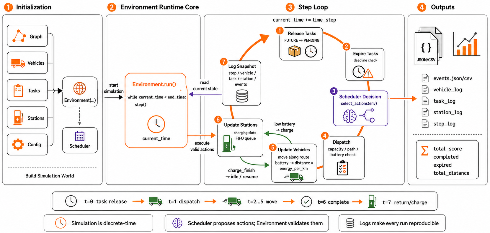

# 03 仿真环境进程运行



## 这张图要表达什么

这张图展示的是 Engine 的仿真环境如何运行。

整体分成四个区域：

```text
Initialization
  → Environment Runtime Core
  → Step Loop
  → Outputs
```

答辩时可以先这样概括：

> Engine 采用离散时间仿真。系统先初始化图、车辆、任务、充电站和配置，然后创建 Environment 并启动 run 循环。每个 step 中依次释放任务、检查超时、调用调度器、执行派单、更新车辆、更新充电站、记录日志，最后推进时间。

## 1. Initialization：初始化阶段

图中第 1 部分是初始化输入。

输入包括：

```text
Graph
Vehicles
Tasks
Stations
Config
```

这些对象被传入：

```text
Environment(...)
```

同时还会设置：

```text
Scheduler
```

可以这样讲：

> 仿真运行前，需要先构建地图图结构、车辆集合、任务集合、充电站集合和配置参数，然后用这些对象创建 Environment。调度器作为决策模块挂接到 Environment 上。

图中这一块底部写着：

```text
Build Simulation World
```

意思是先把仿真世界搭建出来。

## 2. Environment Runtime Core：运行核心

图中第 2 部分是：

```text
Environment.run()
```

里面的核心逻辑是：

```text
while current_time < end_time:
    step()
```

也就是说，仿真不是一次性完成，而是不断推进时间步。

图中的 `current_time` 表示当前仿真时间。

可以这样讲：

> Environment.run 是整个仿真的外层循环，只要当前时间没有达到结束时间，就不断调用 step。每一次 step 表示一个离散时间片。

从初始化阶段到运行核心的箭头标注为：

```text
start simulation
```

## 3. Step Loop：单步仿真循环

图中第 3 部分是最重要的 `Step Loop`。

橙色环形箭头表示每个时间步重复执行的过程。

顶部标注：

```text
current_time += time_step
```

表示每轮结束后推进仿真时间。

## 4. Step 1：Release Tasks

第 1 步是释放任务：

```text
FUTURE → PENDING
```

当任务满足：

```text
release_time <= current_time
```

就从未来任务变成待调度任务。

可以这样讲：

> 每个时间步开始时，Environment 会检查是否有新任务到达。只有释放后的任务才会进入 pending 集合，调度器才能选择。

## 5. Step 2：Expire Tasks

第 2 步是任务超时检查：

```text
deadline check
```

如果：

```text
deadline < current_time
```

并且任务还没有完成，就会变成：

```text
EXPIRED
```

可以这样讲：

> 这一步保证任务有时间约束。如果任务超过截止时间还没有完成，就会被标记为超时，并影响最终得分。

## 6. Step 3：Scheduler Decision

第 3 步是调度决策。

图中紫色框表示：

```text
Scheduler Decision
select_actions(env)
```

调度器读取当前环境状态，然后输出动作，例如：

```text
(vehicle_id, task_id)
```

图中紫色箭头写着：

```text
read current state
```

说明调度器只读取环境状态，不直接修改环境。

可以这样讲：

> 调度器根据当前车辆、任务、地图距离、电量和充电站状态做决策，返回车辆和任务的匹配动作。

## 7. Step 4：Dispatch

第 4 步是执行派单：

```text
Dispatch
capacity / path / battery check
```

Environment 会检查动作是否合法，包括：

```text
车辆是否空闲
任务是否 pending
载重是否足够
路径是否可达
电量是否能完成任务并返回仓库
```

可以这样讲：

> Scheduler 提出的动作不会直接执行，Environment 会先验证约束。这样所有策略都在同一套规则下运行，保证比较公平。

图中间的提示也说明了这一点：

```text
Scheduler proposes actions; Environment validates them
```

## 8. Step 5：Update Vehicles

第 5 步是更新车辆。

图中写着：

```text
move along route
battery -= distance × energy_per_km
```

车辆会沿着 Graph 中的 route 逐段移动。

每个时间步移动距离由速度决定：

```text
move_budget = speed × time_step
```

每移动一段距离，就扣除电量：

```text
energy_cost = distance × energy_per_km
```

可以这样讲：

> 车辆不是瞬间跳到任务点，而是沿着路径逐边移动。每移动一段距离都会增加总里程并消耗电量。

如果车辆低电量，会进入充电逻辑。

图中绿色箭头写着：

```text
low battery → charge
```

## 9. Step 6：Update Stations

第 6 步是更新充电站。

图中写着：

```text
charging slots
FIFO queue
```

充电站更新包括两件事：

```text
1. 给正在充电的车辆增加电量
2. 如果有空闲充电桩，从队列中取下一辆车开始充电
```

队列是先进先出：

```text
FIFO queue
```

图中绿色箭头还表示：

```text
charge_finish → idle / resume
```

意思是车辆充电完成后，可以回到空闲状态，或者恢复之前的回仓意图。

可以这样讲：

> 充电站不是无限资源，而是由充电桩和等待队列组成。Environment 每个时间步都会更新正在充电车辆的电量，并把等待车辆分配到空闲充电桩。

## 10. Step 7：Log Snapshot

第 7 步是记录日志：

```text
Log Snapshot
step / vehicle / task / station / events
```

日志记录当前时间步的完整状态，包括：

```text
step_log
vehicle_log
task_log
station_log
events
```

可以这样讲：

> 每个时间步结束前，Environment 会记录快照。这样我们不仅知道最终结果，还能回看每辆车在哪里、任务什么时候完成、充电站是否排队。

图中底部也强调：

```text
Logs make every run reproducible
```

## 11. Outputs：输出结果

图中第 4 部分是输出。

输出文件包括：

```text
events.json/csv
vehicle_log
task_log
station_log
step_log
```

最终统计包括：

```text
total_score
completed
expired
total_distance
```

可以这样讲：

> 仿真结束后，系统会输出结构化日志和汇总指标。这些数据可以用于实验分析、论文画图和前端可视化。

## 12. 图底部时间线

图底部给了一个简单运行例子：

```text
t=0 task release
  → t=1 dispatch
  → t=2...5 move
  → t=6 complete
  → t=7 return/charge
```

这条时间线可以用来解释一个任务从释放到完成再到回仓或充电的完整过程。

可以这样讲：

> 下面这条时间线是一个具体例子。任务在 t=0 释放，t=1 被派单，车辆在 t=2 到 t=5 沿路径移动，t=6 完成任务，之后根据电量情况回仓或去充电。

## 13. 图底部三个关键结论

图底部三个框可以作为总结：

### 13.1 Simulation is discrete-time

仿真是离散时间推进，不是连续事件模拟。

### 13.2 Scheduler proposes actions; Environment validates them

调度器提出动作，Environment 负责检查和执行。

### 13.3 Logs make every run reproducible

日志记录完整过程，使实验可复现。

## 14. 答辩讲稿

可以照着这段说：

> 这张图展示的是 Engine 的仿真运行流程。首先在初始化阶段，我们构建 Graph、Vehicles、Tasks、Stations 和 Config，并创建 Environment，同时设置 Scheduler。然后进入 Environment.run，它的核心是一个 while 循环，只要 current_time 小于 end_time，就不断执行 step。
>
> 每个 step 是一个离散时间步。第一步释放新任务，把满足 release_time 的任务从 FUTURE 变为 PENDING；第二步检查任务是否超过 deadline，如果超时就变为 EXPIRED；第三步调用 Scheduler 的 select_actions，根据当前环境状态生成车辆和任务的匹配动作；第四步由 Environment 执行 dispatch，并检查车辆是否空闲、载重是否足够、路径和电量是否可行。
>
> 接下来更新车辆。车辆会沿着 route 逐段移动，每移动一段距离就扣除对应电量。如果电量较低，车辆会被引导去充电站。然后更新充电站，包括给正在充电的车辆补电，以及从 FIFO 队列中取下一辆车进入空闲充电桩。最后，Environment 记录当前时间步的 step、vehicle、task、station 和 event 日志，并推进 current_time。
>
> 仿真结束后，系统输出 JSON 和 CSV 日志，以及 total_score、completed、expired、total_distance 等指标。这个流程保证了调度、移动、电量、充电和日志记录都在统一环境中完成。

## 15. 一句话总结

> 这张图的核心是：Environment 通过离散时间循环，把任务释放、调度决策、车辆移动、电量消耗、充电排队和日志输出串成完整的仿真进程。

