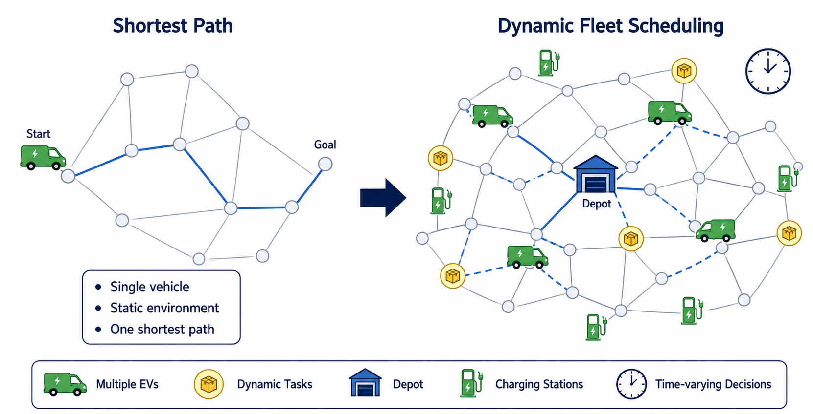
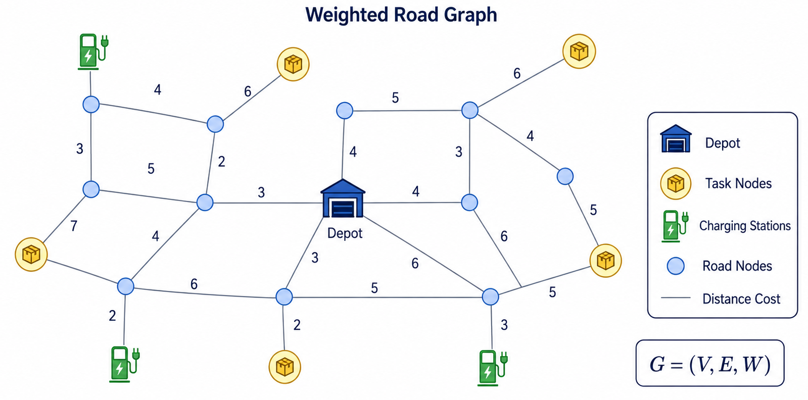
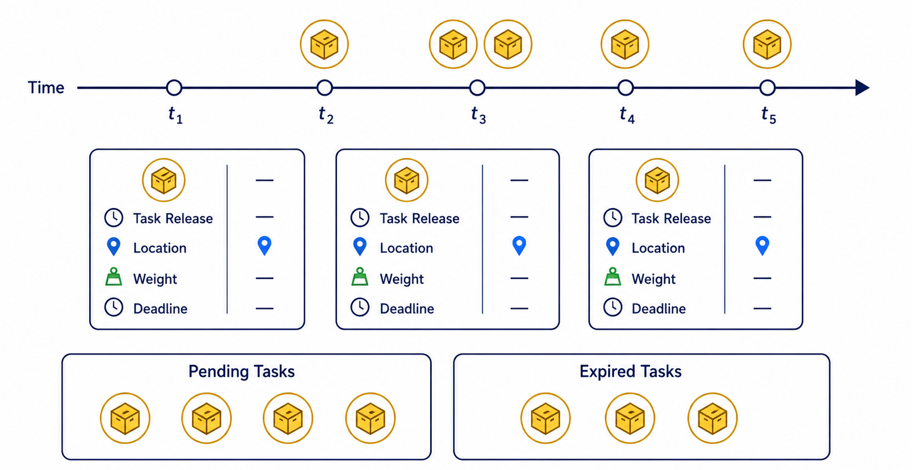
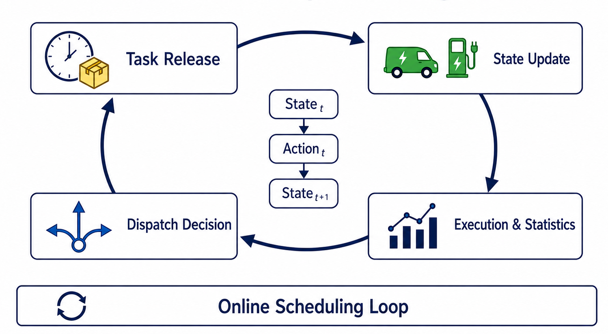
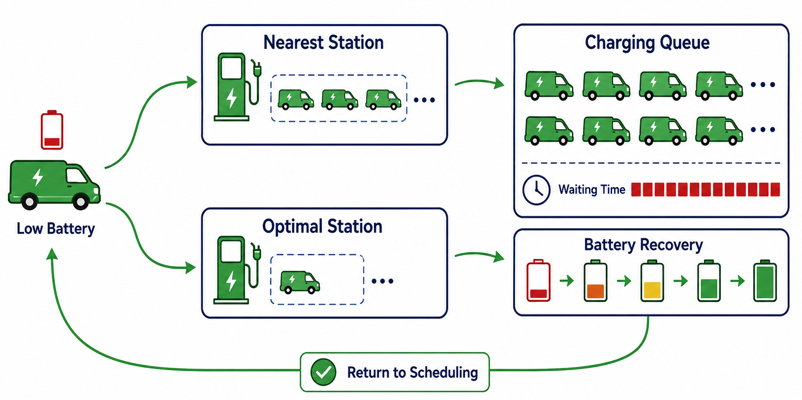
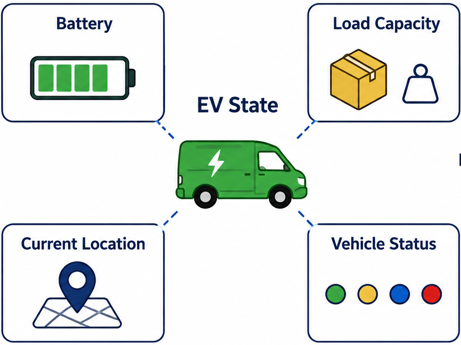
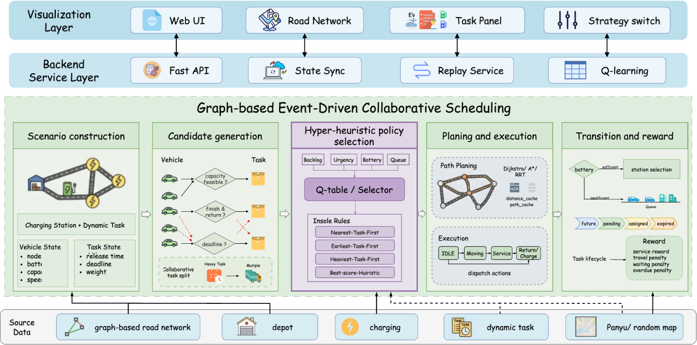

# 问题分析：从最短路到新能源物流车队动态调度

本文档用于配合 `答辩材料/问题分析/` 目录下的 5 组图片进行答辩讲解。整体逻辑是：

```text
1. 问题升级：从最短路径到动态车队调度
2. 路网建模：城市道路抽象为加权图
3. 动态任务：任务随时间释放，形成在线调度问题
4. 车辆约束：新能源车辆存在电量、载重、位置和状态限制
5. 系统闭环：调度、执行、充电、奖励和可视化形成完整系统
```

---

## 第 1 组图：问题升级——不是最短路，而是动态车队调度



### 图中要表达的核心观点

这张图的核心是对比：

```text
Shortest Path
vs.
Dynamic Fleet Scheduling
```

左侧是传统最短路径问题：

- 单车。
- 静态环境。
- 起点和终点固定。
- 目标是找到一条最短路径。

右侧是本项目研究的问题：

- 多辆新能源车。
- 多个动态任务。
- 存在仓库 Depot。
- 存在多个充电站。
- 任务和车辆状态随时间变化。
- 每个时间步都可能需要重新决策。

### 讲解重点

可以这样讲：

> 传统最短路径问题只需要在给定图上，从起点到终点找到一条代价最小的路径。但我们的项目不是解决单条路径最优，而是解决多车辆、多任务、多充电站环境下的连续调度问题。车辆的位置、电量、任务集合和充电站状态都会随时间变化，因此调度策略需要不断根据最新状态做决策。

图底部的图例给出了这个问题的关键元素：

```text
Multiple EVs
Dynamic Tasks
Depot
Charging Stations
Time-varying Decisions
```

这说明问题已经从“图上的一次路径搜索”升级为“图上的动态系统调度”。

### 答辩时可强调

这页最好突出一句话：

> 本项目研究的不是单车最短路，而是带电量和充电约束的新能源物流车队动态调度。

### 过渡到下一页

可以这样转场：

> 既然车辆和任务都发生在城市道路上，第一步就需要把真实道路环境抽象成一个可计算的数据结构，也就是加权路网图。

---

## 第 2 组图：道路环境建模——城市道路的加权图结构



### 图中要表达的核心观点

这张图展示了城市道路如何抽象成加权图：

```text
G = (V, E, W)
```

其中：

| 符号 | 含义 |
| --- | --- |
| `V` | 节点集合 |
| `E` | 道路边集合 |
| `W` | 边权集合 |

图中的元素对应关系：

| 图中元素 | 建模含义 |
| --- | --- |
| 蓝色圆点 | Road Nodes，道路节点或路口 |
| 黑色线段 | 道路连接关系 |
| 数字权重 | Distance Cost，距离或通行成本 |
| 蓝色仓库 | Depot，车辆出发和返回中心 |
| 黄色包裹 | Task Nodes，任务节点 |
| 绿色充电桩 | Charging Stations，充电站节点 |

### 讲解重点

可以这样讲：

> 城市道路被建模为一个加权图。图中的蓝色节点表示道路节点，边表示道路连接，边上的数字表示距离成本。仓库、任务点和充电站都映射到图上的特定节点。这样，车辆从仓库到任务点、从任务点回仓库、从当前位置到充电站的路径，都可以统一转化为图上的路径搜索问题。

### 为什么这个建模重要

后续所有核心判断都依赖这个图：

- 车辆到任务点的距离。
- 车辆到充电站的距离。
- 任务是否可达。
- 完成任务后是否能回仓。
- 车辆移动过程中的距离和能耗。

可以补充：

> 也就是说，图结构是整个调度问题的空间基础。没有这个加权图，后面的任务分配、电量估计和路径规划都无法统一计算。

### 过渡到下一页

可以这样转场：

> 有了道路网络后，下一个问题是任务不是一次性全部给出的，而是会随着时间动态出现。

---

## 第 3 组图：动态任务产生与在线调度闭环

### 3.1 动态任务随时间释放



#### 图中要表达的核心观点

这张图展示任务不是静态给定，而是在不同时间点陆续出现。

时间轴上：

```text
t1, t2, t3, t4, t5
```

不同任务会在不同时间释放。

每个任务包含四类关键信息：

```text
Task Release
Location
Weight
Deadline
```

可以用数学形式表示为：

```text
τ_i = (r_i, v_i, w_i, d_i)
```

其中：

| 符号 | 含义 |
| --- | --- |
| `r_i` | 任务释放时间 |
| `v_i` | 任务位置节点 |
| `w_i` | 任务重量 |
| `d_i` | 任务截止时间 |

#### Pending Tasks 与 Expired Tasks

图下方分成两类任务集合：

```text
Pending Tasks
Expired Tasks
```

含义是：

- `Pending Tasks`：已经释放但尚未完成的任务。
- `Expired Tasks`：超过截止时间仍未完成的任务。

可以这样讲：

> 任务有释放时间和截止时间。只有任务释放后，调度器才能看到并处理它。如果任务超过截止时间仍未完成，就会变成过期任务，并对系统得分产生负面影响。

### 3.2 在线闭环调度过程



#### 图中要表达的核心观点

这张图展示动态任务带来的在线调度闭环：

```text
Task Release
  → State Update
  → Execution & Statistics
  → Dispatch Decision
  → Task Release
```

中间的状态转移是：

```text
State_t → Action_t → State_{t+1}
```

含义是：

- 当前系统状态是 `State_t`。
- 调度器根据当前状态选择动作 `Action_t`。
- 动作执行后，系统进入下一状态 `State_{t+1}`。

### 讲解重点

可以这样讲：

> 由于任务是动态出现的，系统不能只在初始时刻做一次规划。每个时间步，系统都要根据当前车辆、电量、任务和充电站状态做决策。动作执行后，车辆位置、电量、任务完成情况和统计指标都会改变，从而影响下一次调度。

### 过渡到下一页

可以这样转场：

> 在线调度还不够复杂，因为这里的车辆是新能源车。车辆不是只要距离近就能接任务，还必须满足电量、载重、位置和状态约束。

---

## 第 4 组图：新能源车辆约束与充电冲突

### 4.1 车辆状态与任务可行性判断



#### 图中要表达的核心观点

这张图说明：不是所有车辆都能接所有任务。

车辆状态主要由四部分组成：

```text
Battery
Load Capacity
Current Location
Vehicle Status
```

可以抽象为：

```text
x_k = (b_k^max, b_k, c_k, v_k^cur, η_k)
```

其中：

| 符号 | 含义 |
| --- | --- |
| `b_k^max` | 最大电池容量 |
| `b_k` | 当前剩余电量 |
| `c_k` | 最大载重 |
| `v_k^cur` | 当前所在节点 |
| `η_k` | 当前车辆状态 |

#### Feasible Task 与 Infeasible Task

图右侧用绿色和红色区分：

```text
Feasible Task
Infeasible Task
```

判断任务是否可行，至少要检查：

- 电量是否足够。
- 载重是否足够。
- 当前位置到任务点是否可达。
- 车辆是否处于可派单状态。

可以这样讲：

> 即使一个任务离车辆很近，如果车辆电量不足、载重不够，或者车辆正在充电、执行任务，它也不能被分配。因此派单前必须做任务可行性检查。

### 4.2 充电约束与充电队列



#### 图中要表达的核心观点

这张图展示新能源车辆调度中的充电冲突。

当车辆低电量时：

```text
Low Battery
  → Nearest Station / Optimal Station
  → Charging Queue
  → Battery Recovery
  → Return to Scheduling
```

### Nearest Station 与 Optimal Station

图中给出两种充电站选择方式：

```text
Nearest Station
Optimal Station
```

区别是：

- `Nearest Station`：只考虑距离最近。
- `Optimal Station`：综合考虑距离和排队情况。

可以这样讲：

> 最近充电站不一定是最优选择。如果最近站点排队很长，车辆可能等待很久；选择稍远但空闲的站点，反而可能更快恢复调度能力。

### Charging Queue

图右上角展示充电排队：

```text
Charging Queue
Waiting Time
```

说明充电站是有限资源：

- 充电桩数量有限。
- 多辆车可能同时排队。
- 等待时间会影响任务完成率。

### Battery Recovery

图右下角展示电池恢复过程：

```text
低电量 → 逐步充电 → 满电
```

最后回到：

```text
Return to Scheduling
```

说明充电不是调度之外的孤立过程，而是会重新影响后续调度。

### 讲解重点

可以这样讲：

> 新能源车辆调度的一个关键难点是充电会占用时间和资源。车辆低电量时必须暂时退出任务调度，选择充电站、排队、充电，然后再回到调度系统。因此充电行为会改变车辆可用性，也会影响后续任务分配。

### 过渡到下一页

可以这样转场：

> 前面几页分别分析了地图、任务、车辆和充电约束。最后需要把这些因素组织成一个完整的系统流程。

---

## 第 5 组图：系统整体闭环——图驱动、事件驱动、协同调度



### 图中要表达的核心观点

这张图是问题分析部分的总览图。

它展示了从数据源、仿真核心、策略选择、执行反馈到可视化展示的完整系统结构。

整体可以分成四层：

```text
Source Data
Graph-based Event-Driven Collaborative Scheduling
Backend Service Layer
Visualization Layer
```

## 1. Source Data：底层数据来源

图底部是数据源：

```text
graph-based road network
depot
charging
dynamic task
Panyu / random map
```

这些数据对应前几页分析过的核心因素：

- 道路图。
- 仓库。
- 充电站。
- 动态任务。
- 随机或真实地图。

可以这样讲：

> 底层数据提供了整个调度问题的基本环境，包括道路网络、仓库、充电资源和动态任务。

## 2. 核心调度流程

中间绿色区域是核心：

```text
Graph-based Event-Driven Collaborative Scheduling
```

它分为五个模块。

### 2.1 Scenario construction

场景构建包括：

- 充电站。
- 动态任务。
- 车辆状态。
- 任务状态。

对应问题建模阶段。

### 2.2 Candidate generation

候选动作生成会检查：

```text
capacity feasible?
finish & return?
deadline?
```

也就是判断车辆和任务匹配是否可行。

这里还支持：

```text
Collaborative task split
```

即大任务可以拆分给多辆车。

### 2.3 Hyper-heuristic policy selection

中间紫色区域是策略选择：

```text
Q-table / Selector
```

输入状态特征包括：

```text
Backlog
Urgency
Battery
Queue
```

候选规则包括：

```text
Nearest-Task-First
Earliest-Task-First
Heaviest-Task-First
Best-score-Heuristic
```

可以这样讲：

> 策略层不是只固定使用一种启发式，而是根据当前状态选择合适规则。例如任务积压多、电量紧张或队列拥堵时，调度策略可能不同。

### 2.4 Planning and execution

规划与执行包括：

- Path Planning。
- Dijkstra / A* / RRT。
- distance_cache。
- path_cache。
- 执行动作。

执行状态包括：

```text
IDLE → Moving → Service → Return/Charge
```

### 2.5 Transition and reward

右侧是状态转移和奖励：

- 电量足够：继续任务或选择站点。
- 电量不足：进入队列或充电流程。
- 任务生命周期：future、pending、assigned、expired。
- 奖励包括 service reward、travel penalty、waiting penalty、overdue penalty。

可以这样讲：

> 每次调度动作执行后，系统会进入新的状态，并根据任务完成、行驶成本、等待时间和超时情况计算奖励或评价指标。

## 3. Backend Service Layer：后端服务层

图上方第二层是后端服务：

```text
Fast API
State Sync
Replay Service
Q-learning
```

作用是：

- 提供接口。
- 同步仿真状态。
- 支持回放。
- 支持强化学习策略。

## 4. Visualization Layer：可视化层

最上方是可视化层：

```text
Web UI
Road Network
Task Panel
Strategy switch
```

作用是把调度过程展示出来：

- 显示道路网络。
- 显示任务面板。
- 展示车辆和充电状态。
- 支持策略切换。

## 5. 答辩讲稿

可以照着这段说：

> 这张图是整个问题分析的系统总览。底部是数据源，包括道路网络、仓库、充电站、动态任务以及番禺或随机地图。中间绿色区域是图驱动、事件驱动的协同调度流程。首先进行场景构建，把车辆、任务、充电站和地图组织起来；然后进行候选动作生成，检查车辆是否满足载重、电量、截止时间和回仓约束；接着通过超启发式策略选择，在不同规则之间进行选择；之后进入路径规划和执行阶段，车辆在图上移动、服务任务、返回仓库或充电；最后根据任务生命周期、电量、队列和奖励函数更新系统状态。
>
> 上层是后端服务和可视化层。后端通过 FastAPI、状态同步和回放服务支撑前端展示，也支持 Q-learning 策略。前端则展示道路网络、任务面板和策略切换。整体来看，这个问题不是单一算法问题，而是地图、任务、车辆、充电、调度策略和系统展示共同构成的动态闭环调度问题。

---

## 问题分析部分的总讲稿

如果这一部分需要连续讲，可以使用下面这段：

> 我们的问题不是传统最短路径问题。最短路径只需要在静态图中为一辆车找到从起点到终点的最短路线，而本项目面对的是多辆新能源车、多动态任务、多充电站和时间变化下的连续调度问题。
>
> 首先，我们把城市道路建模为加权图 `G=(V,E,W)`，节点表示道路节点、仓库、任务点和充电站，边表示道路连接，权重表示距离或通行成本。这样车辆路径规划、能耗估计和任务可达性判断都可以统一在图上完成。
>
> 其次，任务不是一开始全部给出的，而是随时间动态释放。每个任务包含释放时间、位置、重量和截止时间。调度器只能基于当前已经出现的任务做决策，因此这是一个在线调度问题。每次动作执行后，系统状态都会变化，形成 `State_t → Action_t → State_{t+1}` 的闭环。
>
> 第三，车辆是新能源车，不能只看距离。每辆车都有电量、载重、当前位置和运行状态。任务分配前必须判断车辆是否空闲、载重是否足够、电量是否能完成任务并返回仓库。低电量车辆还要选择充电站、排队、补能，再回到调度系统。
>
> 最后，整个系统形成一个图驱动、事件驱动的协同调度流程。底层是道路图、仓库、充电站和动态任务，中间是候选动作生成、策略选择、路径规划和执行反馈，上层通过后端服务和可视化界面展示结果。因此，本项目本质上是在复杂约束下构建一个可运行、可分析、可展示的新能源物流车队动态调度系统。

## 一句话总结

> 问题分析的核心结论是：本项目从静态最短路径问题扩展到带动态任务、电量约束、充电排队和闭环反馈的新能源物流车队在线调度问题。

